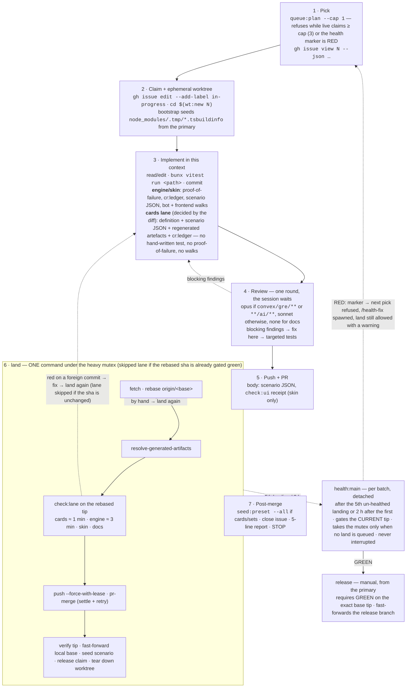

# The `/next-issue` flow after ADR 0136

What one session does from `/next-issue` to a closed issue, where the machine
mutex sits, and how three parallel sessions and the batch health gate share
it. The "before" numbers and the mechanisms they exposed are in ADR 0136
§ Context; this guide draws the flow as decided there. Re-derive the numbers
with `bun run telemetry:latency`.

## 1. One session, one issue



What is gone, compared with the flow measured in ADR 0136: the pre-PR
`check:lane` (paid twice per session because the base moved during it), the
#3286 stale-preflight loop, and the `full` lane on every card PR. The lane is
paid once, on the tree that lands.

## 2. Three sessions, the mutex, and the batch health

Post-cut durations: `land` holds the mutex ~4 min for an `engine` diff
(rebase → lane → push → merge), ~2 min for `cards`; `health:main` ~10 min at
4 workers. Three sessions, the admission cap.

### A · Normal regime — the 5th landing triggers health, a land arrives meanwhile

```mermaid
gantt
    dateFormat mm
    axisFormat %M
    title A · three sessions, health after landing #5
    section S1
    issue A                :a1, 00, 8m
    land #3 (mutex)        :active, a2, 08, 4m
    issue D                :a3, 12, 18m
    waits for health       :crit, a4, 30, 6m
    land #6 (mutex)        :active, a5, 36, 4m
    issue G                :a6, 40, 20m
    section S2
    issue B                :b1, 00, 15m
    land #4 (mutex)        :active, b2, 15, 4m
    issue E                :b3, 19, 19m
    waits (behind S1)      :crit, b4, 38, 2m
    land #7 (mutex)        :active, b5, 40, 4m
    issue H                :b6, 44, 16m
    section S3
    issue C                :c1, 00, 22m
    land #5 → triggers     :active, c2, 22, 4m
    issue F                :c3, 26, 24m
    land #8 (mutex)        :active, c4, 50, 4m
    section health
    health on tip #5 → GREEN :milestone, h0, 26, 0m
    health:main (mutex)    :done, h1, 26, 10m
```

Health runs after #5 merges, detached from the session that triggered it. The
only visible cost: S1 waits 6 min to land #6, S2 2 min behind it. Per 5
landings the machine pays 10 min of full gate once, against ~17 min per landing
before. The counter restarts at 0 on GREEN: #6–#8 are un-healthed again.

### B · Peak — three lands arrive while health holds the mutex; health yields to a queued land

```mermaid
gantt
    dateFormat mm
    axisFormat %M
    title B · health running, three lands queue behind it
    section S1
    issue                  :a1, 00, 2m
    waits 8                :crit, a2, 02, 8m
    land #6 (mutex)        :active, a3, 10, 4m
    issue D                :a4, 14, 26m
    land #9 (mutex)        :active, a5, 40, 4m
    section S2
    issue                  :b1, 00, 4m
    waits 10               :crit, b2, 04, 10m
    land #7 (mutex)        :active, b3, 14, 4m
    issue E                :b4, 18, 26m
    land #10 → triggers    :active, b5, 44, 4m
    section S3
    issue                  :c1, 00, 6m
    waits 12               :crit, c2, 06, 12m
    land #8 (mutex)        :active, c3, 18, 4m
    issue F                :c4, 22, 26m
    land #11 (before health) :active, c5, 48, 4m
    section health
    health on tip #5 → GREEN :done, h1, 00, 10m
    health on tip #11 (covers #6–#11) :done, h2, 52, 8m
```



Worst case: a land arriving right after health starts waits the 10 min plus
the lands queued ahead — with the cap at 3 the ceiling is 10 + 2 × 4 = 18
min, at most once per 5 landings. Two rules keep the peak harmless: health
does not take the mutex while a `land` is queued (S3 lands #11 first), and it
gates the tip current at its start, so one run covers #6–#11 although the
trigger was #10.

### C · RED — health finds an engine test broken by a card PR

```mermaid
gantt
    dateFormat mm
    axisFormat %M
    title C · RED at minute 10, fix healthed at minute 38
    section S1
    issue D (started before RED) :a1, 00, 14m
    land #6 ⚠ on the red tip     :active, a2, 14, 4m
    pick refused (RED) — idle    :crit, a3, 19, 19m
    issue G (worktree from GREEN) :a4, 38, 22m
    section S2
    issue E (started before RED) :b1, 00, 35m
    waits for health             :crit, b2, 35, 3m
    land #7 (mutex)              :active, b3, 38, 4m
    issue H                      :b4, 42, 18m
    section S3 → fix
    free (report done)           :c1, 00, 11m
    /health-fix: reproduce + fix + test :c2, 11, 13m
    land fix (mutex)             :active, c3, 24, 4m
    issue F                      :c4, 28, 32m
    section health
    health on tip #5 → RED       :done, h1, 00, 10m
    RED marker                   :crit, m1, 10, 28m
    health on the fix tip → GREEN :done, h2, 28, 10m
```



RED blocks the **pick**, not the **land**: S1 and S2, already mid-issue,
finish and land (#6 with a warning on the red tip — had it depended on the
breakage, its own targeted tests would have shown it). The price is S1's idle
(19 min); the gain is that no new worktree is born on a red baseline. Without
the pick block, S1 would branch from #5 and see red in its targeted runs
without knowing why — the case that cost the most before.

## 3. The rules the scenarios fix

- **Trigger**: 5th un-healthed landing, or 2 h after the first if 5 are not
  reached; deduplicated by sha; runs detached from the `land` that triggered
  it.
- **Precedence**: a queued `land` goes before a health that has not started
  (B); a running health is never interrupted (A, S1 waits).
- **Coverage**: health gates the tip current at its start, so one run covers
  everything landed meanwhile (B, #6–#11).
- **RED**: durable marker → `queue:plan` refuses the pick; `land` warns and
  proceeds; `/health-fix` is spawned at once; GREEN on the fix tip clears the
  marker (C).
- **Wait ceiling for a land**: health (10) + lands ahead × 4, ≤ 18 min at
  cap 3 — at most once per 5 landings.

## 4. Before and after, per landing

| Scenario                     | Before — gate per landing                                                   | After — gate per landing                                  | Saved                                                             |
| ---------------------------- | --------------------------------------------------------------------------- | --------------------------------------------------------- | ----------------------------------------------------------------- |
| A · normal (6 landings/h)    | 18.9 min (2 × `check:lane` 309 s + 1.35 × `land` 382 s)                     | 4 + 2 (health amortised) = 6 min; waits 1.3 min average   | −12.9 min (−68 %); 113 → 34 machine-minutes per hour              |
| B · peak (4 sessions active) | 28 min (500 s / 507 s under contention)                                     | 5 + 2 = 7 min; waits 8–12, ceiling 18                     | −21 machine-minutes; −11 min latency even counting the wait       |
| C · RED                      | discovered at the next manual release (1–2 days), 3 sessions on the red tip | 2 health runs (20 min) + one fix session; exposure 28 min | machine ≈ equal; exposure −98 %; zero worktrees born on a red tip |

Measured (before) from `.claude/telemetry/telemetry.db`, 2026-09-03 →
2026-09-17; projected (after) from the lane timings in ADR 0136 § Decision 4
and the health duration of the last GREEN `health:main`.
